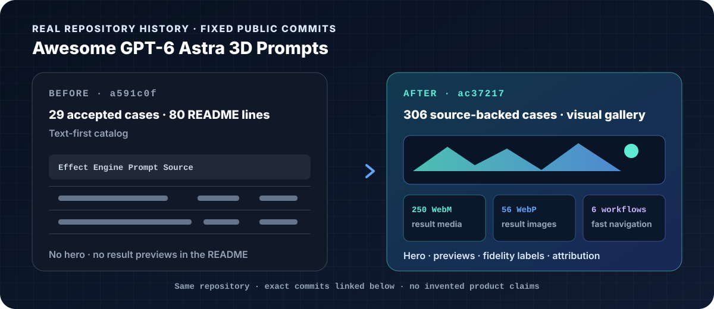

<p align="center">
  
</p>

<p align="center">
  <a href="skills/refine-readme/SKILL.md">Agent Skill</a> ·
  <a href="#quick-start">Quick start</a> ·
  <a href="#from-repository-evidence-to-three-directions">Directions</a> ·
  <a href="#real-before--after">Before / After</a> ·
  <a href="#what-it-delivers">What it delivers</a>
</p>

# README Refiner

README Refiner is an open-source Agent Skill that turns real repositories into
clear, polished, GitHub-ready README homepages.

It does not stop at writing Markdown. It reads the repository first, creates a
project-native cover and visual system, moves real proof forward, checks claims
against source files, and returns a local preview plus a reviewable diff.

## What it delivers

| Layer | Output |
| --- | --- |
| Repository truth | Evidence from manifests, scripts, routes, docs, and existing assets |
| Story and Markdown | A clearer first screen, reading order, Quick Start, examples, and contribution path |
| Cover and identity | A required GitHub-safe SVG cover and a coordinated visual direction |
| Proof and explanation | Real screenshots, output examples, diagrams, comparisons, or workflow SVGs |
| GitHub QA | Link, image, heading, command, accessibility, and maintainability checks |

The body stays searchable and copyable Markdown. SVG is used for exact titles,
diagrams, and visual identity. Raster images are reserved for real screenshots,
generated artwork, and complex proof.

## Quick start

Install the Skill:

```bash
npx skills add BeatAPI/readme-refiner
```

Then ask your Agent:

```text
Use $refine-readme to redesign this repository around its real project theme.
Show me three cover directions and a local preview first. Do not push anything.
```

Or run the deterministic helpers directly:

```bash
python skills/refine-readme/scripts/inspect_repository.py /path/to/repository
python skills/refine-readme/scripts/plan_directions.py /path/to/repository
python skills/refine-readme/scripts/check_readme.py /path/to/repository
python skills/refine-readme/scripts/render_cover.py \
  --style protocol-grid \
  --title "My Project" \
  --tagline "One clear promise backed by real proof" \
  --eyebrow "ASYNC VIDEO API" \
  --proof-label "POST /v1/tasks" \
  --output assets/readme/cover.svg
```

## From repository evidence to three directions

Before creating a cover, the Skill resolves five things: audience, one-sentence
value, primary proof, first successful action, and native visual material. It
then proposes three directions that each identify a repository-specific motif,
proof source, construction mode, hero composition, and risk.

The bundled styles below are direction seeds, not fixed templates. Their palette,
composition, and proof slots are adapted to the project. If removing the project
name would make the result fit an unrelated repository, the direction fails.

## Six cover direction seeds

<p align="center">
  
</p>

| Seed | Best for | Visual language |
| --- | --- | --- |
| Protocol Grid | APIs, SDKs, CLIs, infrastructure | Terminal rhythm, request/response blocks, grids, system paths |
| Product Proof | SaaS, web apps, AI tools | Real screenshots or outputs framed by precise SVG typography |
| Research Field | AI, research, data projects | Flat color, serif-led editorial type, one abstract line metaphor |
| Ink Archive | Databases, system tools, technical research | Warm paper, mechanical ink type, one restrained dot-matrix motif |
| Modular Build | Builders, tutorials, low-code tools | Blocks, nodes, assembly paths, bright constructive space |
| Integration Bridge | Plugins, MCP servers, API integrations | Two endpoints, one connector, restrained brand-derived accents |

Generated imagery never owns exact project text. When a style needs an organic
subject, image generation creates only the subject or background; deterministic
SVG overlays the project name, commands, labels, and factual claims.
User covers contain no README Refiner watermark or branding by default.

## Real Before / After

<p align="center">
  
</p>

The public [`BeatAPI/awesome-3d-prompts`](https://github.com/BeatAPI/awesome-3d-prompts)
history provides a durable comparison: the
[`a591c0f` snapshot](https://github.com/BeatAPI/awesome-3d-prompts/blob/a591c0ffee88fb5d529f4da0931465ce37980a25/README.md)
is an 80-line, text-first catalog with 29 accepted cases; the
[`ac37217` snapshot](https://github.com/BeatAPI/awesome-3d-prompts/blob/ac37217b7b723fbe38095503e06e3b818fbb1a85/README.md)
is a 300+ case visual gallery with a hero, workflow navigation, result media,
prompt-fidelity labels, and source attribution.

[See the evidence and exact comparison](examples/awesome-3d-prompts-before-after.md).
This is a real repository-history reference for the Refiner quality bar, not a
claim that this Skill authored the historical commits.

## Modes

| Mode | Behavior |
| --- | --- |
| `audit` | Read-only review of clarity, proof, trust, and maintenance cost |
| `cover` | Recommend three directions and create cover assets only |
| `beautify` | Apply the complete project-native workflow and produce a README diff |
| `check` | Run factual and GitHub rendering checks without redesigning |

No mode commits, pushes, opens a pull request, or publishes without explicit
approval.

## Output contract

A complete run normally produces:

```text
README.md                         proposed Markdown change
assets/readme/cover.svg           editable exact-text cover
assets/readme/cover.webp          optional generated or screenshot layer
assets/readme/architecture.svg    optional workflow or system explanation
.readme-refiner/report.json        facts, warnings, and decisions
.readme-refiner/preview/           local desktop and mobile previews
```

## Design principles

- Start from real repository evidence, never a generic project template.
- Make the project understandable before showing installation details.
- Require a cover in complete beautify mode, but do not require AI artwork.
- Prefer real product proof over decorative imagery.
- Keep commands copyable and body text searchable.
- Show a local preview and diff before changing the user's public repository.
- Never invent capabilities, benchmarks, customers, compatibility, or support.
- Keep attribution optional; do not inject watermarks or hidden promotional links.

## Status

This is the first public version. The project-native direction gate, six cover
seeds, repository inspector, direction planner, README checker, and deterministic
SVG renderer are available now.
GitHub-like browser previews, additional project fixtures, and continuous README
checks will be added through real repository usage.

## Contributing

New styles and public before/after examples are welcome. Each style must explain
what projects it fits, preserve exact text, include negative constraints, and
show at least one real repository result. See [CONTRIBUTING.md](CONTRIBUTING.md).

## License

MIT
---

<sub>Maintained by <a href="https://github.com/BeatAPI"><b>BeatAPI</b></a> · <a href="https://beatapi.io">beatapi.io</a> — async AI video APIs for music videos and product ads.</sub>
