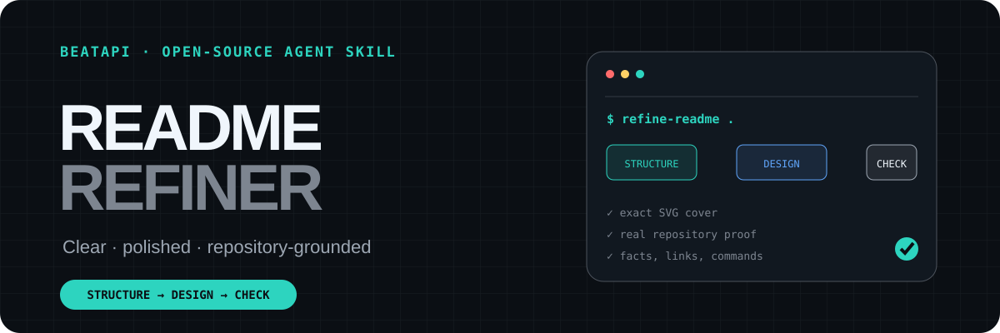
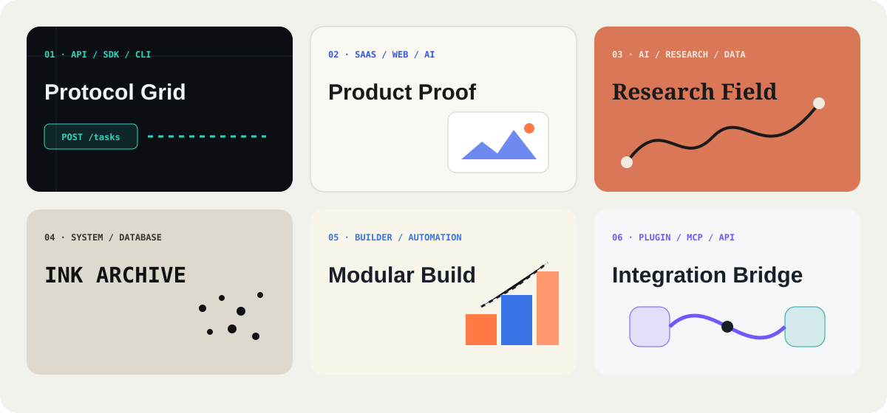

<p align="center">
  
</p>

<p align="center">
  <a href="skills/beautify-readme/SKILL.md">Agent Skill</a> ·
  <a href="#quick-start">Quick start</a> ·
  <a href="#six-project-native-cover-directions">Cover styles</a> ·
  <a href="#what-it-delivers">What it delivers</a>
</p>

# README Studio

README Studio is an open-source Agent Skill for turning a real repository into
a README people can understand, trust, and keep reading.

It does not stop at writing Markdown. It reads the repository first, creates a
project-native cover and visual system, moves real proof forward, checks claims
against source files, and returns a local preview plus a reviewable diff.

## What it delivers

| Layer | Output |
| --- | --- |
| Repository truth | Evidence from manifests, scripts, routes, docs, and existing assets |
| Story and Markdown | A clearer first screen, reading order, Quick Start, examples, and contribution path |
| Cover and identity | A required GitHub-safe SVG cover and a coordinated visual direction |
| Proof and explanation | Real screenshots, output examples, diagrams, comparisons, or workflow SVGs |
| GitHub QA | Link, image, heading, command, accessibility, and maintainability checks |

The body stays searchable and copyable Markdown. SVG is used for exact titles,
diagrams, and visual identity. Raster images are reserved for real screenshots,
generated artwork, and complex proof.

## Quick start

Install the Skill:

```bash
npx skills add BeatAPI/readme-studio
```

Then ask your Agent:

```text
Use $beautify-readme to redesign this repository around its real project theme.
Show me three cover directions and a local preview first. Do not push anything.
```

Or run the deterministic helpers directly:

```bash
python skills/beautify-readme/scripts/inspect_repository.py /path/to/repository
python skills/beautify-readme/scripts/check_readme.py /path/to/repository
python skills/beautify-readme/scripts/render_cover.py \
  --style protocol-grid \
  --title "My Project" \
  --tagline "One clear promise backed by real proof" \
  --output assets/readme/cover.svg
```

## Six project-native cover directions

<p align="center">
  
</p>

| Style | Best for | Visual language |
| --- | --- | --- |
| Protocol Grid | APIs, SDKs, CLIs, infrastructure | Terminal rhythm, request/response blocks, grids, system paths |
| Product Proof | SaaS, web apps, AI tools | Real screenshots or outputs framed by precise SVG typography |
| Research Field | AI, research, data projects | Flat color, serif-led editorial type, one abstract line metaphor |
| Ink Archive | Databases, system tools, technical research | Warm paper, mechanical ink type, one restrained dot-matrix motif |
| Modular Build | Builders, tutorials, low-code tools | Blocks, nodes, assembly paths, bright constructive space |
| Integration Bridge | Plugins, MCP servers, API integrations | Two endpoints, one connector, restrained brand-derived accents |

Generated imagery never owns exact project text. When a style needs an organic
subject, image generation creates only the subject or background; deterministic
SVG overlays the project name, commands, labels, and factual claims.

## Modes

| Mode | Behavior |
| --- | --- |
| `audit` | Read-only review of clarity, proof, trust, and maintenance cost |
| `cover` | Recommend three directions and create cover assets only |
| `beautify` | Apply the complete five-layer workflow and produce a README diff |
| `check` | Run factual and GitHub rendering checks without redesigning |

No mode commits, pushes, opens a pull request, or publishes without explicit
approval.

## Output contract

A complete run normally produces:

```text
README.md                         proposed Markdown change
assets/readme/cover.svg           editable exact-text cover
assets/readme/cover.webp          optional generated or screenshot layer
assets/readme/architecture.svg    optional workflow or system explanation
.readme-studio/report.json        facts, warnings, and decisions
.readme-studio/preview/            local desktop and mobile previews
```

## Design principles

- Start from real repository evidence, never a generic project template.
- Make the project understandable before showing installation details.
- Require a cover in complete beautify mode, but do not require AI artwork.
- Prefer real product proof over decorative imagery.
- Keep commands copyable and body text searchable.
- Show a local preview and diff before changing the user's public repository.
- Never invent capabilities, benchmarks, customers, compatibility, or support.
- Keep attribution optional; do not inject watermarks or hidden promotional links.

## Status

This is the first public version. The core workflow, six cover presets, repository
inspector, README checker, and deterministic SVG renderer are available now.
GitHub-like browser previews, additional project fixtures, and continuous README
checks will be added through real repository usage.

## Contributing

New styles and public before/after examples are welcome. Each style must explain
what projects it fits, preserve exact text, include negative constraints, and
show at least one real repository result. See [CONTRIBUTING.md](CONTRIBUTING.md).

## License

MIT
